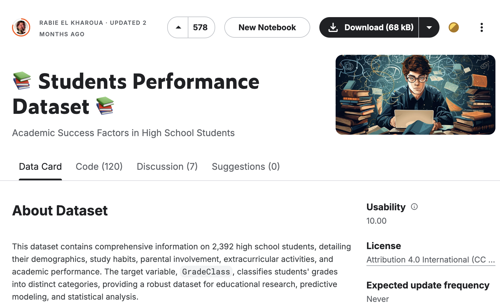
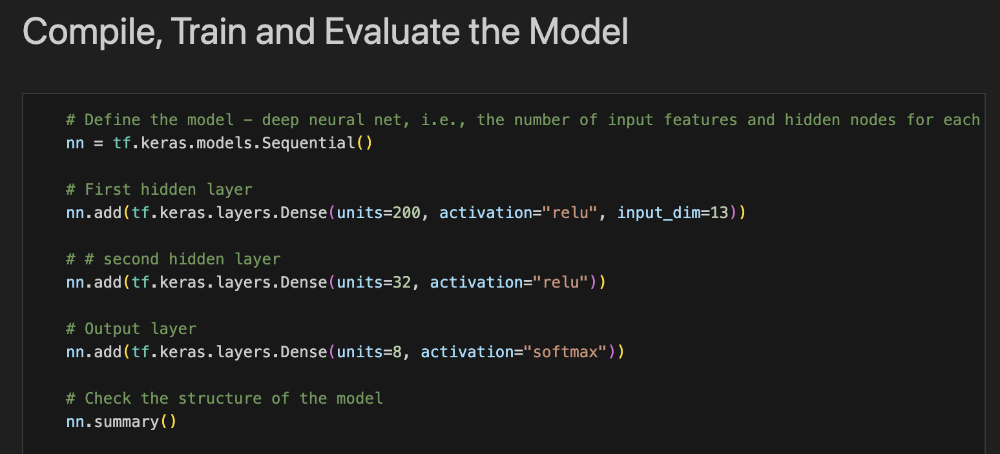

# Student Performance Project
## Overview
- For this project, we examined various features that could possibly contribute to the performance of a college student. Our goal was to utilize machine learning to predict the outcome of a students grade based off of variables that we were considering.
## Tasks
- In this project, we identified a Kaggle data source that incorporated many of the elements we were hoping to explore.

- Using existing techniques, we applied machine learning to help us explore the data set and create a predictive model.

- Once we successfully created our model, we identified the features that most consistently predicted student performance, and then created visualizations to help illustrate their impact.
    - [Tableau Visual #1](https://public.tableau.com/app/profile/april.johnson6790/viz/Project4_17236807529930/GPAvsFinalGrade)
    - [Tableau Visual #2](https://public.tableau.com/app/profile/jeremy.morris6320/viz/project4_new_17236815724590/Dashboard1?publish=yes)
    - [Final Presentation](https://docs.google.com/presentation/d/1HxGfKVzZ7iK8QNVYUABa_aRD2WZlGHnuUSw3MrECL4o/edit?pli=1#slide=id.g7818f8d3bf_2_972)
## Ethical Data Use Consideration
- In our pursuit of developing a model that would allow us to make accurate predictions of student success, we made sure to follow best practices regarding ethical use of data. We made sure to utilize data that was cleaned of any personal identifying information, the date set came from a reputable source, and did not negatively impact any individuals involved in the collection of this data.
## Sources and Citation
- Kharoua, R. E. (2023). Students performance dataset. Kaggle. https://www.kaggle.com/datasets/rabieelkharoua/students-performance-dataset/data
- OpenAI. (2024). ChatGPT (Version 4.0) [Large language model]. https://chat.openai.com/

